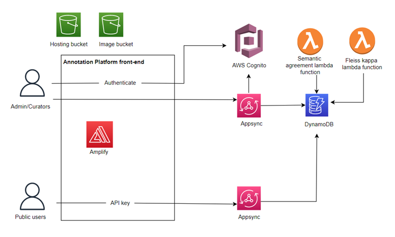
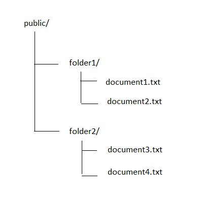
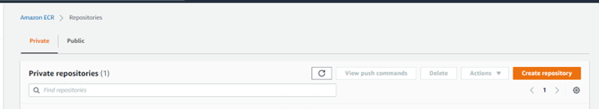
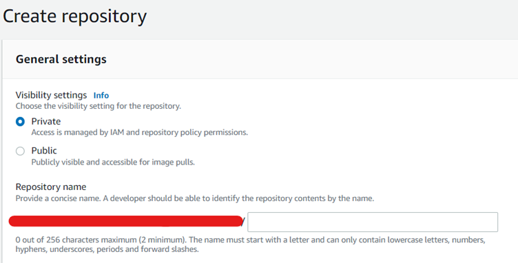
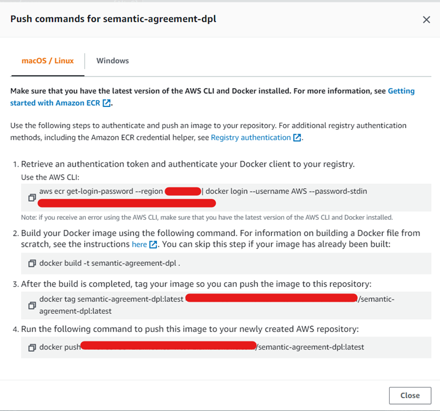
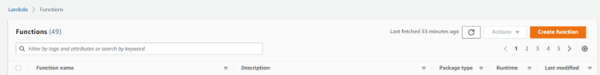
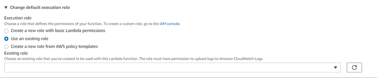
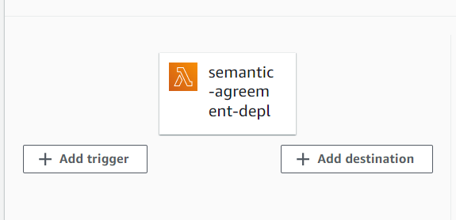

# Open Source Text annotation platorm

This platform was developed with the help of the Pansurg community, with the aim of providing a way to accommodate the document annotation and evaluation method currently used by Pansurg. 

The platforms makes use of Amazon Web Services resources such as S3 and DynamoDB through use the AWS Amplify framework. A GraphQL API is used to interact with data items stored in DynamoDB. 

It is important to note that it is assumed that administrators have full access to the AWS account on which the resources will be hosted.

# Features

## Administrator

The administrator is able to assign tasks to curators, reassign incomplete tasks and delete tasks.  

### Assign tasks

Each annotation task has several features: the annotation instructions, the document to be annotated, the text highlight for indicated Named Entity recognition (NER) labels, and the categorical annotation questions to classify/evaluate the document. Each feature needs to be selected in the task creation page, which will be accessible to the administrator upon sign-in 

### Form creation

Question forms can be created from the “Question Form creation” tab within the task creation page, with will then be stored in the Question Form DynamoDB table for the environment. 

### Reassign tasks

Administrators can reassign any incomplete tasks with the “Reassign tasks” page.

### Delete tasks

Question centric task deletion is possible from the task deletion page.

### Active tasks

Ongoing progress of incomplete tasks can be seen in the “Active tasks” page.

## Curator

### Annotation

Curators are able to view all annotation tasks assigned to them within the “Tasks” tab, and can then annotate and submit them. All completed task results are viewable in the “Completed tasks” page. 

## Public

The home page is available to all users and displays annotation results for completed tasks.

# Platform structure

The outline of the platform architecture can be seen below:



## Lambda functions

The semantic agreement and the inter-annotator agreement are calculated with Lambda functions. The Spacy library used within the calculation of the semantic agreement is unfortunately too large to be used in the classic Lambda deployment package and is hosted within a Docker image (a feature currently not supported by Amplify). The semantic agreement therefore has its own manual setup process as described in the Setup section.

## Data Storage

All annotation data is stored as items in DynamoDB, and is free for retrieval. NER  labels for each annotation task in the annotation task DynamoDB table within the “labels” item. Categorical question answers are stored in the “question_answers” item.

The semantic agreement and inter-annotator agreement, calculated by the lambda functions,  is stored within the “Medical Question” data item. 

Annotation documents are stored within an S3 image bucket. 

# Administrative process

## Users

It is assumed that the Administrator has access to the AWS account hosting the platform resources. Once the annotation platform is fully set up, to create account, simply press the “Sign in” button on the top right hand corner and press “Create account” to create a new profile. Once the account is confirmed, the new user will need to be added to the correct group manually. From the AWS web console, navigate to the Cognito interface and select “Manage User Pools”. Select the user pool for the newly created environment. From “Users and groups”, select “Groups” and the “Admin” group. From here, add the newly created user to the “Admin” group to access the administrative features in the site. To add curators, repeat this process instead with the ”Curators” group. Each user will need to be manually reviewed to ascertain what permissions they should have. Once a curator has been added, annotation tasks can now be assigned to them by the task creation process. 

## Documents

Documents for annotation will be stored in the S3 bucket associated with created Amplify environment. Document will also have to be uploaded by use of the AWS console. Navigate to the S3, and select the image bucket for the relevant Amplify environment. Create a “public” folder, and navigate to it. Within this folder, create new folders to subdivide the annotation documents. Documents can then be stored within these folders. These documents can then be selected from the task creation page. 



## Curators per document

The number of curators per document can be changed by altering the .env file within platform directory and changing the REACT_APP_NUMBER_CURATORS environment variable. 

# Contribution

More features may be added to the platform. Currently, The question format only supports single answer categorical questions. More question format may be added by altering relevant elements such as the “QuestionFormCreation”, “AnnotationQuestions” and “TasksId” components within the directory. 

The highlight component currently does not support mobile use, if a new highlight tool is to be created, relevant changes will need to be made to the “AnnotationPage” component.

Currently a maximum of 10 different labels with colours are able to be assigned to the documents. Additional colours may be added through alteration of the colours defined in the “adminConstants” file. 

If you wish to make any changes to the code, fork the repository, add a feature or fix a bug and then file a pull request to merge changes into the main repository.

# Set-up

This project makes use of the amplify cli and react-specific dependencies:

```sh
npm install -g @aws-amplify/cli
npm install aws-amplify @aws-amplify/ui-react
```

An AWS account is also required to be configured, details of which is shown here: 

[https://docs.amplify.aws/start/getting-started/installation/q/integration/react/#option-2-follow-the-instructions](https://docs.amplify.aws/start/getting-started/installation/q/integration/react/#option-2-follow-the-instructions)

The lambda function for the semantic agreement makes use of Docker:
```sh
npm install -g docker
```

The project can then cloned with the command whilst in an empty directory:
```sh
amplify init –app <project-github-url>
```

Accept all existing configurations. You will then be issued with a series of prompts. Enter the new name for the Amplify environment which will host the resources for the platform. Choose the default editor of your choice, and use the AWS profile that was set up previously. 

Once the resources have been successfully set up, run the following command: 

```sh
amplify push
```

Install all dependencies with the following command:

```sh
npm install
```

Once all dependencies have been installed, it should now be possible to launch the application in your local host with:

```sh
npm start
```

# Setting up the Semantic agreement lambda container image

The semantic agreement lambda function requires separate setup, as Amplify unfortunately does not support deployment of Docker images as Lambda functions. Docker is required, so make sure this is installed.

Navigate to the “lambda-docker” folder within the project directory and change the variables medicalQuestionTable and annotationTaskTable to the names of your project tables. Change <your-api-endpoint> to the relevant endpoint for your api (accessible via the Appsync console>API for platform environment> Settings>API ID), and replace <your-environment> with the name of your environment. 

Now you need to create an ECR repository and create a new repository to store the image.

Navigate to Elastic Container Registry interface and click “Create Repository” in the right hand corner.



Enter the name of the repository (e.g. semantic-agreement) and click “Create repository”



Navigate to the newly created repository and click “View push commands” at the top right hand corner of the site. Some instructions should be available in the format as follows:



Simply copy and paste these instructions in order while within the lambda-docker folder, and the image should be built and pushed to the ECR repository.

## Creating the Lambda function

Navigate to the Lambda management console within the AWS user interface, and select “Create function” as shown here:



Within the create function page, click “Container image”. Enter the function name (e.g. semantic-agreement) and paste the URI of the ECR repository created earlier.



Change the default execution to an existing one. From the dropdown, select the Lambda role associated with the project environment, which should have been created upon project initialisation.

After creation, click “Add trigger” and select the “Annotation task” table for the project environment. Be sure to reduce the batch size from 100 to 20. 



A final step is to change the timeout in “General configuration” from 3 secs to 60 secs, change the max memory used to 3000MB and the ephemeral storage to 2048.

# Deployment

To deploy the platform, navigate to the Amplify console within the AWS web user interface and select the annotation platform application. Within “Hosting environments”, connect a new branch and select the desired branch as well as the amplify environment. Make sure the GitHub account is authenticated. Confirm and deploy. The amplify.yml build file is shown here: 

```sh
version: 1
env:
  variables:
    VERSION_AMPLIFY: 8.4.0
backend:
  phases:
    preBuild:
      commands:
        - npm i aws-amplify
        - npm i @aws-amplify/auth
    build:
      commands:
        - '# Execute Amplify CLI with the helper script'
        - amplifyPush --simple
frontend:
  phases:
    preBuild:
      commands:
        - npm install
    build:
      commands:
        - npm run build
  artifacts:
    baseDirectory: build
    files:
      - '**/*'
  cache:
    paths:
      - node_modules/**/*
```

Within Rewrites and Redirects, also make sure to add the following rule:

Source address: </^((?!\.(css|gif|ico|jpg|js|png|txt|svg|woff|ttf)$).)*$/>

Target addres: /index.html

Type: 200 (Rewrite)

Country code: -
